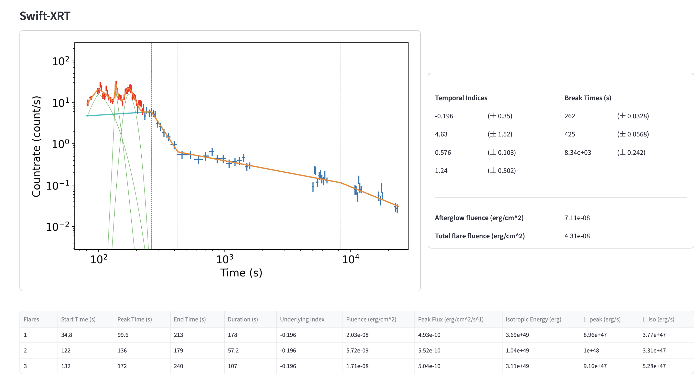
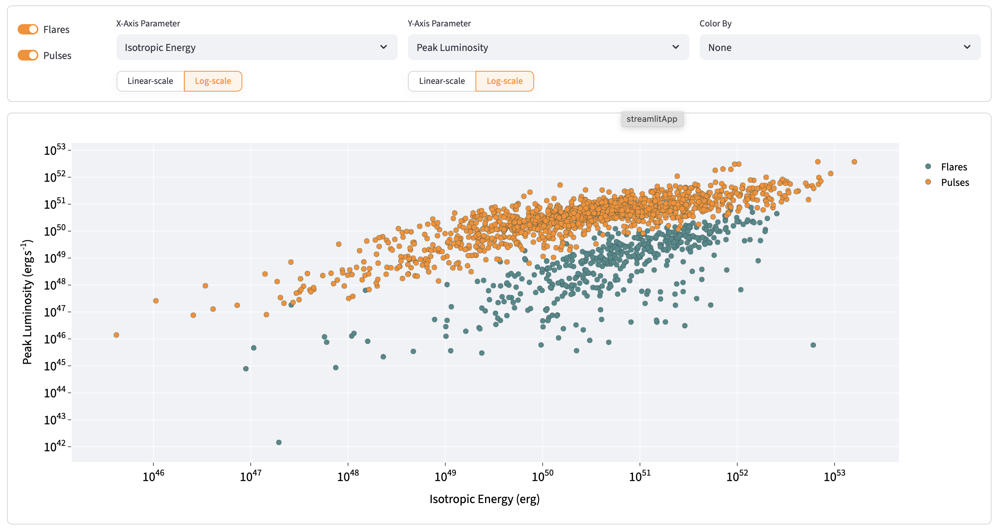

# LAFF Viewer

**LAFF Viewer** is a Streamlit-based data visualization tool designed to explore and the modelled light curves of *gamma-ray bursts (GRBs) from the *Swift* mission, fitted with the Lightcurve and Flare Fitter (LAFF).

https://laffviewer.streamlit.app

This tool serves as the front-end visualisation component for a data pipeline I developed as part of my PhD at the University of Leicester, providing an accessible interface to study the individual automated fits of X-ray afterglows, flares, and gamma-ray pulses; and also the parameters of the *Swift* GRB catalogue in its entirety.

This sample represents all *Swift* GRB datasets through to May 2025.
- **X-ray Afterglows:** 1273
- **X-ray Flares:** 1019
- **Gamma-ray Pulses:** 3994

## Overview

### Burst Viewer

Easily search for any individual burst. Displays the XRT and BAT light curve fits, model parameters as well as some temporal and energetic parameters that can be calculated.

  
   
  <em>The Burst Viewer interface showing a fitted XRT lightcurve with flare components.</em>

### Population Statistics

Plots to display various parameters for the Swift GRB catalogue in its entirety -- either plotting the afterglow parameters against each other, or the population of flares and pulses.

The plots are fully interactive. The X and Y axis parameters are changed with a simple dropdown menu, and can be toggled between log and linear scaling. Optionally, you can use a colour scaling to provide a third axis for a third parameter. It is also possible to manually select one or more specifics bursts to be highlighted, which are tracked as you change parameters.

If any data points stand out, you can click on that data point to be taken directly to the burst viewer page for that afterglow, pulse or flare, to manually inspect the fitted results for this burst.

When plotting the flare and pulse populations, there are toggles to plot either set individually, or both on the same figure.

The X and Y-axis parameters 

  
   
  <em>The combined flares and pulses plot for isotropic energy against peak luminosity.</em>

## LAFF

The underlying **LAFF** pipeline provides automated fitting for *Swift* datasets.

- The XRT pipeline identifies 'deviations\ from the afterglow using smoothing filters and rise-tracking. The afterglow is fitted with a broken power law with 0 to 5 breaks, and the deviations are modelled using one or more flare components.
- The BAT algorithm uses iterative filtering to estimate local noise before marking deviations. Pulse components are added iteratively and tested for statistical significance.

The basic functionality of the code is described on the [LAFF Viewer - About Page](https://laffviewer.streamlit.app/about_laff), and in full detail available in my thesis (accepted with minor revisions; pending link). The code itself is made open-source and accessible from the [LAFF GitHub repository](https://github.com/ajhenne/laff/).

## Acknowledgements

The main LAFF code was created as part of an STFC funded PhD project at the University of Leicester. LAFF Viewer is a subsequently created tool. This work makes use of several works in terms of obtaining raw light curve data, and some parameters used as part of subsequent analysis:

- Evans, P.A. et al. (2007) ‘An online repository of Swift/XRT light curves of gamma-ray bursts’, Astronomy & Astrophysics, 469(1), pp. 379–385. Available at: https://doi.org/10.1051/0004-6361:20077530.                
- Evans, P.A. et al. (2009) ‘Methods and results of an automatic analysis of a complete sample of Swift -XRT observations of GRBs’, Monthly Notices of the Royal Astronomical Society, 397(3), pp. 1177–1201. Available at: https://doi.org/10.1111/j.1365-2966.2009.14913.x.
- Lien, A. et al. (2016) ‘THE THIRD SWIFT BURST ALERT TELESCOPE GAMMA-RAY BURST CATALOG’, The Astrophysical Journal, 829(1), p. 7. Available at: https://doi.org/10.3847/0004-637X/829/1/7.
- This work utilizes data supplied by the UK Swift Science Data Centre at the University of Leicester.

### Citing this work

The results of this work may be used freely by anyone with the appropriate credit. Should any work derived from LAFF and its results leads to a publication, I ask that you appropriately acknowledge the main LAFF pipeline (rather than this data visualiation tool) with a footnote pointing to the LAFF GitHub (https://github.com/ajhenne/laff), and referencing either the GitHub repository (see `citation.cff`) or my PhD thesis, in which the methodology is described:

> Hennessy, A. and Starling, R.L.C. (2025) 'LAFF: Lightcurve and Flare Fitter for Swift GRB lightcurve modelling', GitHub: https://github.com/ajhenne/laff

> Hennessy, A. (2026) 'The Central Engines of Gamma-Ray Bursts', Thesis, University of Leicester

This work is built on the light curves made available by the *Swift* team, and hence by proxy you should also reference them appropriately for any work leading to a publication. That is, both Evans et al. (2007) and Evans et al. (2009) as above, and the requested acknowledgement:

> This work utilizes data supplied by the UK Swift Science Data Centre at the University of Leicester.